# Hướng dẫn học tập trong dịp hè nè:
Tớ sẽ giới thiệu cho bé về hai web cực hay để học là `Hack The Box Academy` và `PortSwigger`
- `Hack The Box Academy` dạy rất thực tế và đào tạo thiên về mindsets, kỹ năng, kiến thức nền tảng cực chắc để khai thác, tấn công, sau này làm Red hay Blue Team đều được. Đây sẽ nơi bé học chính để làm nền tảng nhaaa
- `PortSwigger` thì thuần về `web security`, bài học cũng có phần dễ hơn `Hack The Box Academy` nên nó sẽ đóng vai trò bổ trợ kiến thức và là nơi có lab để thực hành thêm thôi.
- CHÚ Ý: TẤT CẢ CÁC BÀI LAB, THỰC HÀNH PHẢI THỰC HIỆN TRÊN MÔI TRƯỜNG MÁY ẢO SẼ ĐƯỢC TỚ HƯỚNG DẪN BÊN DƯỚI.
## 1. Đăng kí và học tập bằng Hack The Box Academy:
### Bước 1: Đăng kí tài khoản
Truy cập bằng đường link này `https://academy.hackthebox.com/`. Đăng kí ` Bấm vào Start for free nha`, đăng nhập bằng gmail cho tiện nha:

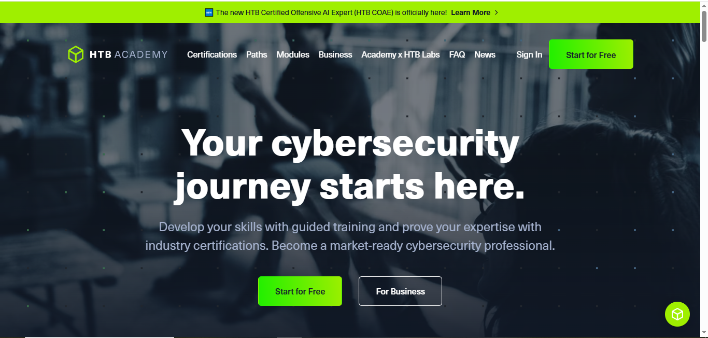

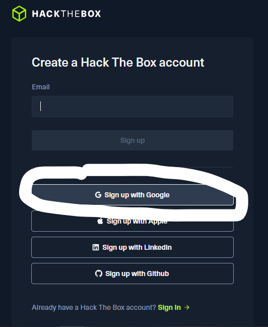

### Bước 2: Vào học
- Phần học sẽ chia ra thành 3 đơn vị: `Modules`, `Paths` và `Job Role Path`. `Modules` là đơn vị bé nhất, là 1 bài học về 1 chủ đề cụ thể. `Path` chứa 3 đến 4 `Modules` tập trung về 1 mảng nhỏ các kĩ năng gì đấy. `Job Role Path` là lớn nhất, chứa rất nhiều `Modules` và gần như cung cấp đẩy đủ các kỹ năng để làm nghề.
- Đây là phần `Modules`:

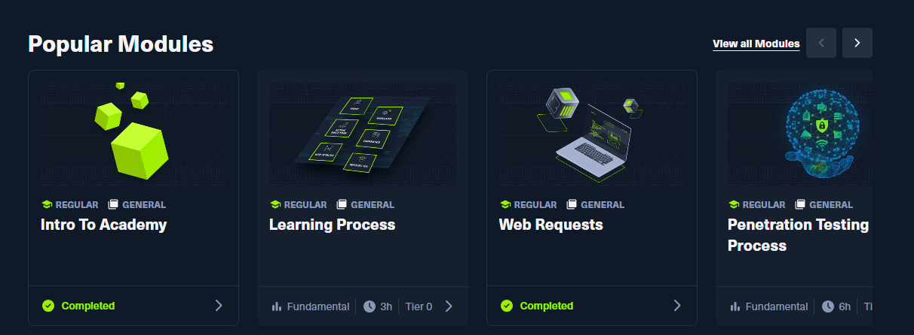

- Đây là phần `Path`:

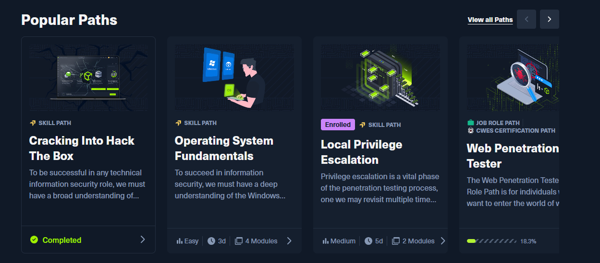

- Đây là phần `Job Role Path`:

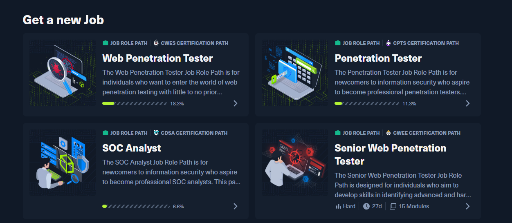

- `Cubes` là đơn vị "tiền tệ" ở trong này:

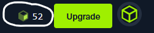

Khi bé học một `Modules` nào đó bé sẽ phải trả một số `Cubes` tùy theo `Tier` của `Modules` đó và sau khi hoàn thành `Modules` sẽ được nhận lại một số `Cubes` theo quy định. Ví dụ:

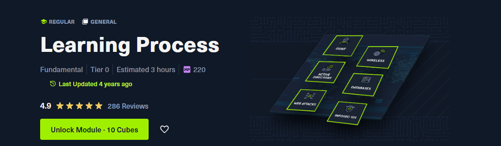

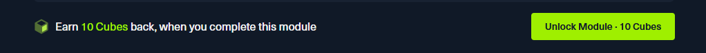

Đây là một `Modules` có `Tier` là 0: Mình sẽ phải trả 10 `Cubes` cho nó và sau khi hoàn thành mình sẽ nhận lại được 10 `Cubes`
- Mình sẽ được cấp mặc định ban đầu là 60 `Cubes` nên mình sẽ học được hết tất cả các `Modules` `Tier` 0 miễn phí (do mất 10 `Cubes` để unlock và học xong được thưởng lại 10 `Cubes`).
- Từ `Modules` có `Tier` 1 và cao hơn số `Cubes` phải bỏ ra để unlock lại nhiều hơn số `Cubes` được thưởng khi hoàn thành nên không nên học các `Modules` này.
- Theo như tớ thấy bé học được hết các `Modules` `Tier` 0 là đủ cho kiến thức cơ bản rồi.
- Khi học theo `Path` thì chọn `enroll path` rồi trong đó vẫn unlock lần lượt từng `Modules` bình thường nhóoo

### Bước 3: Các `Modules`, `Path` nên học đầu tiên:
- Tớ thấy `Path`: `Cracking into Hack the Box` này rất dễ học và là `Path` mở đầu cho quá trình học tại `Hack The Box Academy`

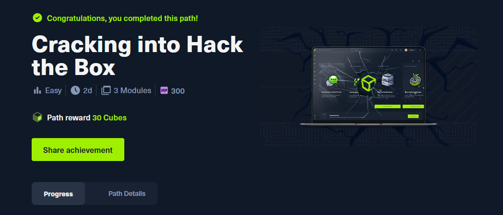

- `Modules`: `Linux Fundamentals` QUAN TRỌNG NHẤT vì đa phần hệ thống chúng ta tương tác sẽ là Linux và nó sẽ dạy bé những câu lệnh cơ bản để tương tác với hệ thống.

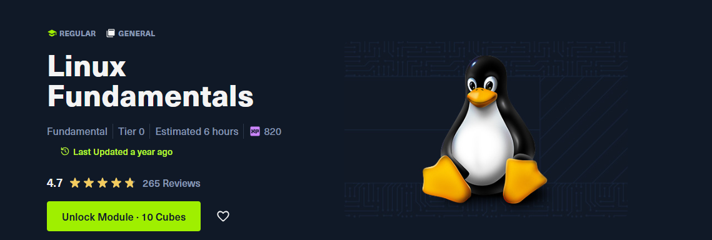

- `Modules`: `Web Fuzzing` này siu siu quan trọng luôn ở đây bé sẽ biết được về kĩ thuật `Web Fuzzing`, một trong những kĩ thuật ban đầu cực kì quan trọng trong Pentest.

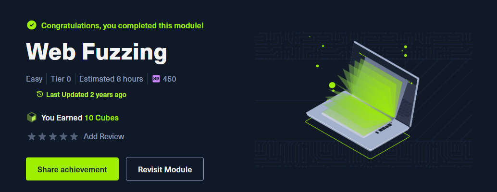

- `Modules`: `Attacking Web Applications with Ffuf` nói sâu hơn về `ffuf` là công cụ cực mạnh cho `Web Fuzzing` mà bé học được ở `Modules` trên:

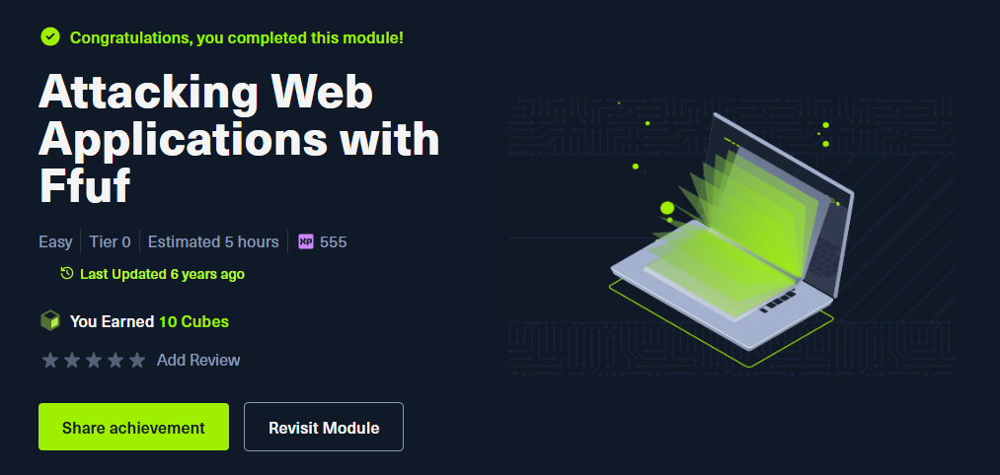

- Cuối cùng là các `Modules` lẻ `Tier` 0 còn lại, về những chủ đề rất hay, bé lọc ra rồi học nhaaa:

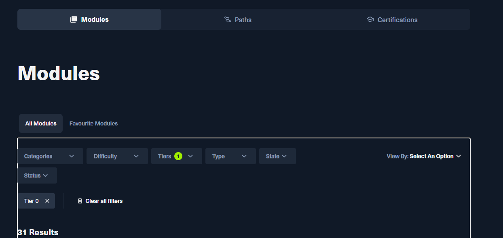

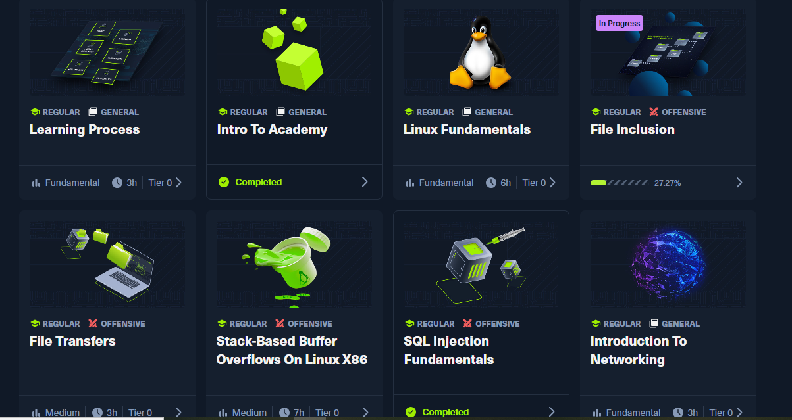

### Bước 4: Tương tác với máy ảo trong quá trình học:
- Trong quá trình học, sẽ có những bài thực hành luôn, `Modules` sẽ cung cấp `địa chỉ IP của mục tiêu ` và bên trên sẽ có máy ảo `Pwnbox` (coi như là máy của chúng ta dùng để tấn công) trông như thế này:

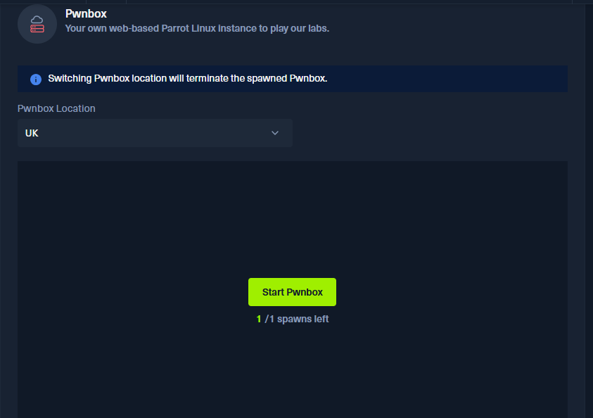

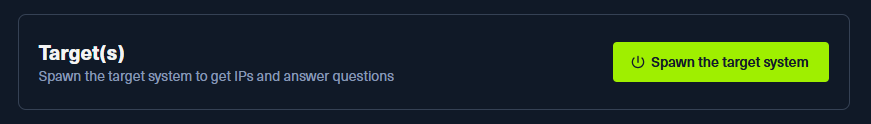

Nhớ bấm `Spawn the target system` để tạo `địa chỉ IP mục tiêu ` nhaaa.
Vấn đề là do chúng ta dùng free nên cái máy ảo `Pwnbox` chỉ dùng được 1 lần có thời hạn 2 tiếng trong ngày thôi. Rất may là ngiu bé đẹp zai và thông minh nên đã tìm ra cách là: sử dụng máy ảo mà tớ đã cài cho bé trên `VMware` thay cho `Pwnbox`. Về cơ bản máy ảo trên `VMware` là hệ điều hành tên là `Parrot OS` chuyên dụng cho ATTT, có sẵn hầu hết các công cụ cần thiết để tương tác với `địa chỉ IP mục tiêu` rồi.

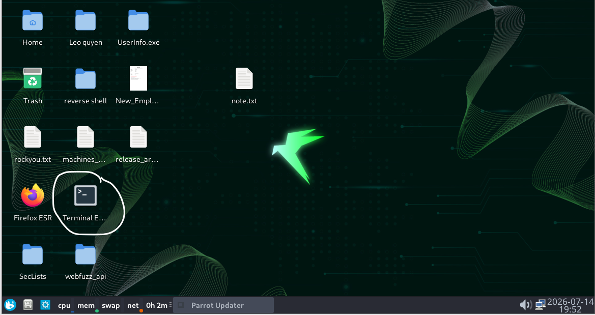

`Terminal` là chỗ tớ khoanh tròn là nơi mình chạy lệnh nha. Còn `Firefox` là trình duyệt web có hình con cáo màu cam (hiểu đơn giản là nó giống y hệt `Google`) sẽ sử dụng để tương tác với web nha.
- Có những bài tập yêu cầu phải kết nối VPN mới làm được thì nó sẽ download 1 file cấu hình VPN về. Bé phải tải file đó về máy mình (nó có 2 chế độ là UDP và TCP thì nên tích vào ô TCP nhé vì TCP ổn định hơn mà) rồi copy file đó từ máy thật của mình vào máy ảo `VMware` rồi chạy lệnh `sudo openvpn <tên_file_vpn>` ở 1 terminal để vào mạng nội bộ rồi GIỮ NGUYÊN terminal đó để nó chạy. Các lệnh khác bé mở terminal khác lên để chạy nha. (cái này có nhắc đến ở `Path`: `Cracking into Hack the Box`).
### Ghi chú cuối cùng về phần này nè:
- Nội dung học trên này bằng Tiếng Anh hoàn toàn và sẽ có những kiến thức khá khó và đôi khi học sẽ bị nản.
- Tớ nghĩ bé nên học theo chu kỳ bấm giờ học 45 phút rồi nghỉ 10 phút sẽ giữ được sức khỏe cho bản thân cũng như không bị mệt, nản.
- Tớ cũm nghĩ là học thế này vừa học được ATTT và Tiếng Anh luôn nên cố lên nha.
- Bé hoàn toàn có thể sử dụng AI để hỗ trợ dịch cũng như hỏi thêm về kiến thức nha. Nhưng hỏi hay học được gì mới nhớ `take note` và học thật sự hiểu bản chất nha.
- TIPS: học về Ý TƯỞNG, BẢN CHẤT (tại sao lại tấn công như thế? làm thế để làm gì?, đó là lỗ hổng gì?) còn KHÔNG CẦN phải ghi nhớ lệnh do hoàn toàn có thể tra được lệnh cũng như ở mỗi `Modules` sẽ có 1 bảng các lệnh chi tiết được hướng dẫn để bé tải về và sử dụng:

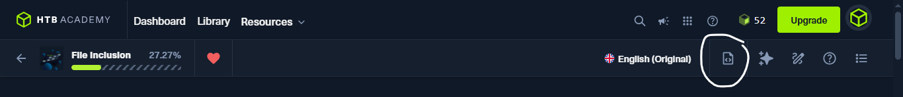

Tải về ở nút khoanh tròn nha.
### Học tập trung, Mệt thì nghỉ chứ KHÔNG ĐƯỢC nản, KHÔNG ĐƯỢC bỏ cuộc nhaaaaaaaaaaaaaaaaaaaa !!!!!!!!!!!

## 2. Đăng kí và học tập bằng PortSwigger 
### Bước 1: Đăng kí tài khoản
- Vào theo link này nhó: `https://portswigger.net/web-security`

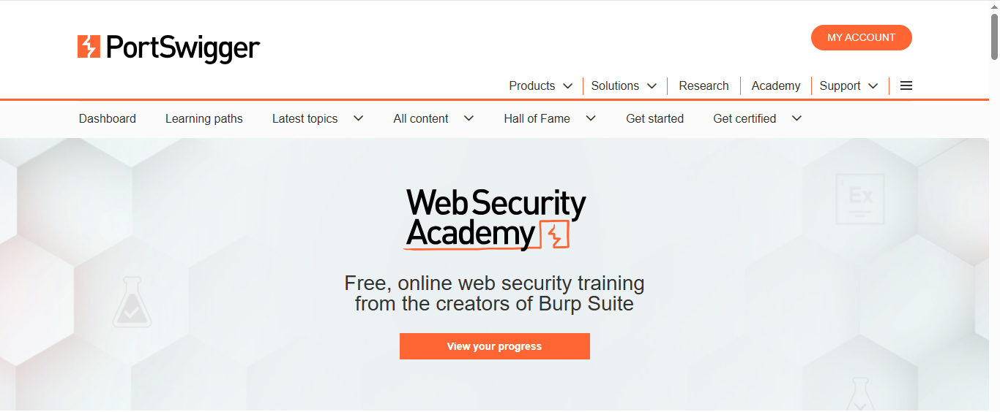

### Bước 2: Vào học
- Vào mục `learning path` để học nha: `https://portswigger.net/web-security/learning-paths`

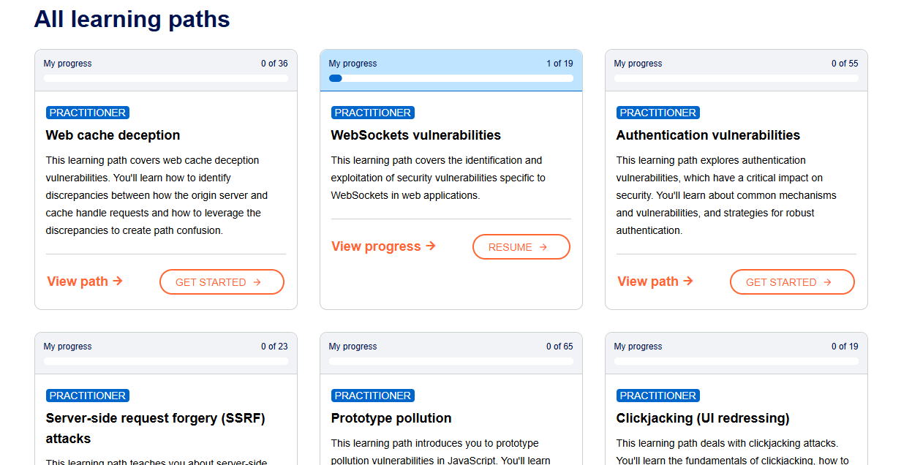

### Note:
- Học trên web này chủ yếu luyện về `web security` và bài học khá dễ hơn so với bên `Hack The Box Academy`
- Tớ thấy bé nên học bên `Hack The Box Academy` trước để luyện nền tảng và mindset của hacker rồi luyện tập, đọc, thực hành thêm ở lab bên này.